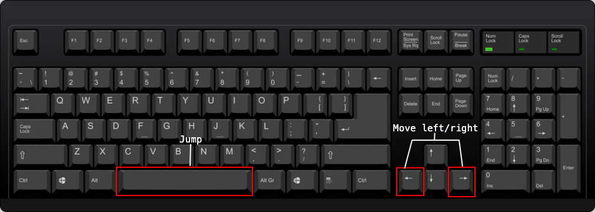

# At World's Edge
[insert logo here (and maybe background or something idk)]
# User Documentation
## Controls

Left and right arrow keys - moves the player left and right respectively

Space bar - allows the player to jump

Currently there are no mouse controls

[insert an image of the player's walk sprite here]

## Objectives and Walkthrough
[basic plot summary here]

[insert the walkthrough here]

# Developer Documentation
## Features
For quite a few of the features coded into my game I used [these tutorials](https://www.youtube.com/playlist?list=PLgOEwFbvGm5o8hayFB6skAfa8Z-mw4dPV), either for the complete code (this was usually when it came to the basic movement code, as I was still getting used to using C# and Unity at the time, and the tutorials were very beginner friendly), or for the basic code for the feature, which I then modified to better fit what I wanted for the game. 
### Movement and Jumping
For the movement and jumping code, I followed the tutorials listed above, since these were the first features I added to the game. I had little to no trouble when it came to errors in the code, as most of them were due to typos I made while coding. 
### Wall jumping
Wall jumping was a little harder for me to code, as I was continously encountering issues unrelated to the code, meaning I couldn't look through the tutorial to try to fix them. Almost all of these issues were related to the hitboxes and colliders of various game objects, which made the bugs much harder to find, as this wasn't something I initially thought to check. 
### Hazards and Health
For the hazards and health, I decided to modify the code and features in the tutorial, as what I wanted for the health system in my game was slightly different to what the tutorial presented. These modifications were mainly minor things, such as changing the amount of maximun health that the player had from 3 to 5, which I changed for two reasons. The first reason being that I wanted to make the game more accessible to players who might not be as experienced with platformers, since I myself am not the greatest at them, and the second being that I intended for my levels to be a lot longer than those shown in the tutorial, with a lot more environmental hazards that the player must avoid (as this is related to the main plot of the game). 

I also changed the type of hazard added in as a base, in order to better fit the aesthetic and worldbuilding of my game. 
### Parallax Background
The parallax background effect is arguably one of my favourite features which I added to the game. Not only does it make the gameplay experience much more immersive by adding a more realistic effect to the background, but it was also the biggest feature which I figured out a simple solution to without using a tutorial, and was surprisingly simple to do. 

I initially had a tutorial saved for my parallax background effect, however that tutorial was very short and didn't really involve any actual coding, as the code was copied and pasted from somewhere else. I did try it, however the backgrounds were extremely laggy when I tried playing using that code (and I knew this was the code, as nothing else in Unity was lagging on my laptop). After that, I didn't feel like following another tutorial, as I knew the logic which was required to code the parallax, and just needed to figure out how to code it in. 

After some thinking I realised that the logic I wanted to use for the parallax background was very similar to the code used for the camera movement, as they were both taking an object and making it follow the player. I tried adding the camera movement script to the individual background layers, and it worked quite well as a base, as the background was now following the player rather than remaining in one position. However, I knew I wanted to modify it into an actual parallax code, as it still looked quite unnatural. 

The first idea I had for making it into a proper parallax was to find a camera movement code which allowed the camera to look further ahead when the player moved left and right. This way, the background would move at a different speed to the player when they were moving. Thinking back on it, this very likely wouldn't have produced the effect I wanted for the background, however I didn't end up getting to the point of actually coding this in anyway as many of the examples I was looking at were much more complex than my base camera movement code. 

While skimming through a few tutorials, I found a devlog which mentioned that parallax backgrounds are simply the different elements of the background moving at different speeds, which gave me a new idea for how to create the parallax background. After browsing a few more forum posts and a few more compilation errors, I had the idea to simply subsitute the code for the player's speed into the section controlling camera movement, which ended up working extremely well once I figured out how to properly set the speed of different objects (which was to set the background's speed to 1, and lower the speed slightly the closer to the foreground the objects were). 

## Bug Fixing
### Collider and Hitbox Issues (Wall Jumping)
As I mentioned in the features section of the developer documentation, the feature which I had the most trouble with while adding (and was considering scrapping altogether). A large majority of these bugs were due to collider issues, which were easy enough to fix once I found them, however they were quite hard to actually find in the first place, as I was basically still a complete beginner when coding this, and the colliders were the last thing that I thought to check. 

The first major issue I had with wall jumping was laughably easy to fix once I actually found the source of the issue. The tutorial which I was following had a part where it tested whether or not the player was on the wall in order to make sure the initial code was working before proceeding to adding the acutal walls. The idea was that the console would print 'true' if the player was touching the wall, and 'false' if they weren't. It was pretty simple, however my game kept returning true even when I wasn't near the wall. 

The root of the problem turned out to be that I had duplicated the tilemap of the floor when creating the wall, as I wanted to make sure I didn't miss adding any important properties (as the only real difference between the floor and wall was that one of them was classified as a well and one wasnt). However in doing this, I completely forgot to remove the tiles which belonging to the initial floor tilemap, causing the floor to be a part of the wall. This was probably the worst bug out of all of my code, as it was an extremely simple fix, yet it took several weeks to fix, since I didn't even think to check that part. 

After this, there was only one other big issue I had with the colliders, where the collider I was using for the wall was causing the player to get stuck to the wall, however changing the collider and messing around with the settings seemed to fix this. 

### Collider and Hitbox Issues (Health and Damage)

### Wall and Floor Issues
